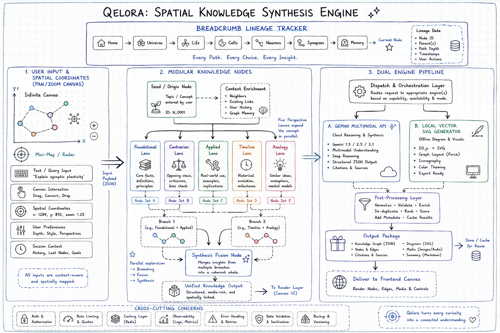

# Product Requirements Document (PRD)
## Project Name: Qelora
**Product Concept:** Infinite Spatial Knowledge Graph & Visual Synthesis Engine  
**Document Version:** 1.0.0  
**Status:** Live & Production Ready  

---

## 1. Executive Summary

### 1.1 Problem Statement
Traditional knowledge retrieval tools and chatbots present information in linear, chat-bubble silos. This makes it difficult for researchers, engineers, and curious learners to:
- Form mental models across complex interconnected concepts.
- Branch off in multi-dimensional directions (critiques, engineering implementations, cross-domain analogies).
- Discover non-obvious intersections between two disparate domains.
- Retain knowledge through multi-sensory formats (visual diagrams, text breakdowns, schematic flows, and audio summaries).

### 1.2 Solution & Vision
**Qelora** is an infinite spatial knowledge graph and ideation canvas. It visualizes thoughts as rich spatial nodes connected by dynamic relational paths. Users can explore concepts non-linearly, branch with targeted intellectual perspectives, synthesize distant ideas into breakthrough discoveries, and export their research into polished reports.

---

## 2. Target Audience & Personas

| Persona | Needs & Goals | Core Value from Qelora |
|---|---|---|
| **Academic & Independent Researchers** | Deep-dive into technical papers, discover counter-arguments, and trace paradigms over time. | Perspective lenses (Deep Dive, Contrarian, Timeline) & Markdown report exports. |
| **System Architects & Engineers** | Understand component mechanics, data flows, and trade-offs visually. | Schematic relationship diagrams & blueprint generation. |
| **Students & Lifelong Learners** | Grasp challenging abstract topics across physics, biology, and philosophy. | Multi-modal explanations (interactive link branching, imagery, audio briefings). |
| **Creative Innovators & Writers** | Cross-pollinate ideas from different disciplines to generate novel hypotheses. | Cross-Disciplinary Synthesis Engine. |

---

## 3. Core Capabilities & Feature Specifications

### 3.1 Infinite Spatial Canvas
- **Coordinate Matrix:** Smooth infinite 2D canvas with panning, trackpad pinch-to-zoom (0.2x to 2.5x), and click-drag.
- **Spatial Minimap (Radar):** Real-time interactive minimap in the corner tracking all node coordinates, bounding boxes, and active viewport frustum.
- **Lineage Breadcrumb Trail:** Real-time top navigation bar that recursively traces the active exploration path back to the origin root, color-coding each intellectual perspective and allowing instant single-click camera focus.
- **Auto-Layout Engine:** One-click tree organizer to re-align tangled branches into clean hierarchical clusters.
- **Fluid Connections:** Bezier connecting curves color-coded by perspective angle with animated energy flow pulses.

### 3.2 Multi-Perspective Node Generation (Top Feature 1 Extended)
When expanding a node or term, users can choose specific intellectual lenses:
1. **Standard / Exploration:** Broad, engaging executive overview with key highlights.
2. **Deep Dive:** Rigorous technical formulation, underlying mathematics, foundational axioms.
3. **Contrarian:** Critical counter-paradigms, edge cases, competing hypotheses, and epistemological limitations.
4. **Applications:** Real-world implementations, industrial case studies, and engineering deployments.
5. **Timeline:** Historical breakthroughs, pivotal experiments, and 5-10 year frontier projections.
6. **Analogy:** Cross-domain isomorphisms (e.g. mapping neural networks to ecological balance).

**Node Anatomy:**
- 16:9 Contextual Graphic Header (switchable across styles)
- Executive synopsis badge & perspective tag
- Segmented View Tabs:
  - **Insight:** Rich markdown text with clickable keyword branching (`[Term](Term)`).
  - **Diagram:** Structured schematic flowchart of causal/component relationships.
  - **Briefing:** AI speech synthesis with interactive audio waveform player.
- Core Takeaways checklist (3 punchy bullet points).
- Multi-directional suggested branches dock & custom follow-up query input.
- Version history carousel (re-roll and cycle between iterations).

### 3.3 Cross-Disciplinary Synthesis Engine (Top Feature 2 Extended)
- **Arbitrary Pair Fusion:** Modal tool allowing users to select any two nodes on the canvas.
- **Emergent Synergy Generation:** Analyzes the semantic intersection to generate a new hybrid breakthrough node.
- **Dual Visual Lineage:** Renders dual bezier connecting lines from both parent nodes into the synthesized node.

### 3.4 Multi-Style Visual Generator
Allows switching node visuals on-the-fly between 4 artistic/intellectual styles:
- **Editorial:** High-contrast, clean cinematic composition.
- **Schematic Blueprint:** Dark minimalist technical wireframes and circuit/topology graphs.
- **Sketch:** Botanical/scientific notebook charcoal drawing.
- **Abstract 3D:** Vibrant isometric render with iridescent material reflections.

### 3.5 Export & Knowledge Portability
- **Markdown Research Report:** Complete multi-chapter `.md` document including summaries, key insights, takeaways, and branch frontiers.
- **JSON Project State:** Backup format containing node graph topology, coordinate positions, and version histories.
- **Clipboard Utility:** Single-click copy for quick pasting into Obsidian, Notion, or Roam Research.

---

## 4. Technical Architecture

### 4.1 System Components
- **Client Application:** React 19 + TypeScript + Tailwind CSS v4 + Motion (`motion/react`) with Lucide icons.
- **Backend Service:** Express 4 API server with Vite development middleware, bundled to a standalone CommonJS file (`dist/server.cjs`) for production.
- **AI Core:** Google Gemini 3.7 Flash (`@google/genai`) configured with structured JSON response schemas and a strict 3-tier pedagogical hierarchy (Factual Definition → Mechanics & Pipeline → Theoretical Complexity & Frontiers).
- **Search & Entity Extraction:** Preambles and conversational clauses are automatically parsed to extract exact domain concepts with automatic collision-free canvas positioning.
- **Resilient Fallback Engine:** Curated offline knowledge database spanning computer science, machine learning, physics, biology, and economics for zero-downtime operation.
- **DevOps & Containerization:** Multi-stage `Dockerfile`, `docker-compose.yml`, and GitHub Actions automated CI workflow (`.github/workflows/lint.yml`).

---

## 5. Non-Functional & Design Requirements

- **Zero Promotional Noise:** Immediate access to canvas upon launch; no landing carousels or artificial splash roadblocks.
- **Aesthetic Theme:** Sophisticated neutral slate dot canvas (`#F8FAFC`), crisp high-contrast cards, and mathematical nested radii.
- **Fault-Tolerance:** Zero unhandled UI crashes. If cloud API rate limits or network issues occur, the server engine transparently provides structured semantic knowledge and vector schematics.
- **Performance:** Optimized vector rendering with `pointerEvents: none` overlays, sub-component virtualization, and memory-safe audio object revocation.

---

## 6. Future Roadmap

- **Multiplayer Live Collaboration:** Multi-user shared cursor canvases using WebSockets.
- **Vector Embedding Clustering:** Automatic force-directed clustering based on semantic cosine similarity.
- **Custom Document Upload:** Drop PDF/EPUB research papers onto the canvas to parse into interactive concept graphs.
- **Native LaTeX Formula Rendering:** MathJax/KaTeX integration for advanced physics and mathematical equations.