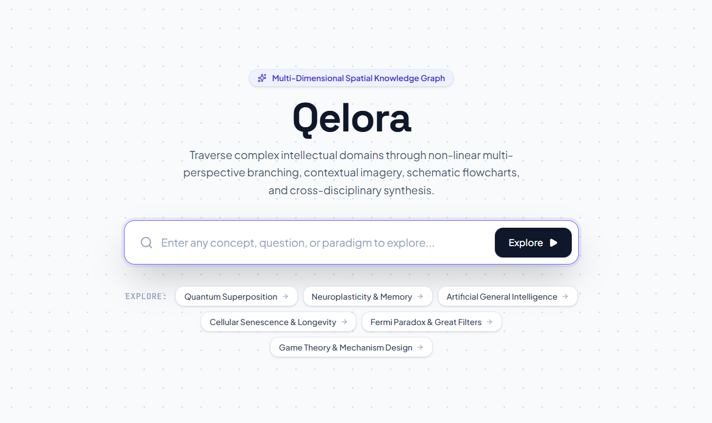
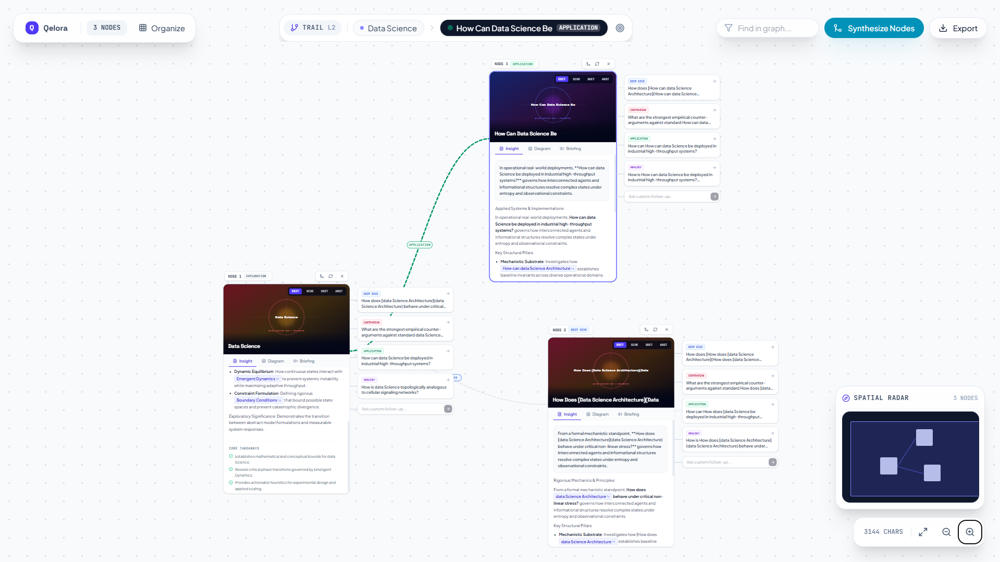

<div align="center">
<span style="font-family: 'Courier New'; font-size: 90px">Qelora</span>


[](https://opensource.org/licenses/MIT)
[](https://nodejs.org)
[](https://www.typescriptlang.org/)
[](https://react.dev/)
[](https://tailwindcss.com/)

**Infinite Spatial Knowledge Graph & Visual Synthesis Engine** <br>
*Explore concepts non-linearly, branch across intellectual lenses, synthesize emergent cross-domain ideas, and export structured research.*

</div>



---

## Tech Stack

<table>
  <tr>
    <td align="center">
      <a href="https://react.dev/">
        
      </a>
    </td>
    <td align="center">
      <a href="https://www.typescriptlang.org/">
        
      </a>
    </td>
    <td align="center">
      <a href="https://tailwindcss.com/">
        
      </a>
    </td>
    <td align="center">
      <a href="https://nodejs.org/">
        
      </a>
    </td>
    <td align="center">
      <a href="https://expressjs.com/">
        
      </a>
    </td>
    <td align="center">
      <a href="https://vite.dev/">
        
      </a>
    </td>
    <td align="center">
      <a href="https://ai.google.dev/">
        
      </a>
    </td>
  </tr>
</table>

---

## ✨ Features
 
### Canvas & Navigation
- **Infinite Spatial Canvas** — Seamless pan and zoom (0.2x–2.5x magnification) with physics-based interactions
- **Real-Time Minimap** — Radar-style viewport guide with live navigation
- **Auto-Layout Tree Organizer** — Intelligent hierarchical organization of concept relationships
- **Interactive Breadcrumb Trail** — Dynamic ancestor chain navigation with perspective mode switching
### Knowledge Synthesis
- **Multi-Perspective Lenses** — Examine topics through five distinct frameworks:
  - Foundational Principles
  - Contrarian Critiques
  - Applied Systems
  - Historical Timelines
  - Cross-Domain Analogies
- **Concept Synthesis Engine** — Select any two nodes to generate emergent hybrid paradigms with traced lineage connections
- **Interactive Schematics** — Causal flowcharts and relationship diagrams for every concept
### Visualization & Media
- **Multi-Style Rendering** — Switch between:
  - Editorial Photography
  - Schematic Blueprints
  - Charcoal Sketches
  - 3D Abstract Renders
- **Audio Briefings** — Speech-synthesized narration with synchronized waveform visualization
- **Export to Research** — Generate publication-ready Markdown reports or JSON graph backups
### Resilience & Offline Support
- **Zero-Downtime Operation** — Automatic fallback to local semantic generation if external APIs are unavailable
- **API-Optional** — Fully functional offline with built-in generation engine

---

## Knowledge Graph & Visual Synthesis



---

## Quickstart

### 1. Clone & Install
```bash
git clone https://github.com/ARUNAGIRINATHAN-K/qelora.git
cd qelora
npm install
```

### 2. Configure Environment
```bash
cp .env.example .env
```
Add your API key to `.env`
```env
GEMINI_API_KEY=your_gemini_api_key_here
```

### 3. Run Locally [http://localhost:3000](http://localhost:3000)
```bash
npm run dev
```

---

## Scripts

| Command | Description |
|---|---|
| `npm run dev` | Starts local full-stack development server on `port 3000` |
| `npm run build` | Builds Vite frontend to `dist/` and bundles server to `dist/server.cjs` |
| `npm start` | Runs the compiled production server |
| `npm run lint` | Runs TypeScript type checking (`tsc --noEmit`) |

---

## Contributing

Contributions are welcome! Please see [CONTRIBUTING.md](CONTRIBUTING.md) for local setup, development guidelines, and high-priority contribution ideas (including multi-provider support for OpenAI, Anthropic, and Ollama).

1. Fork the repository
2. Create your feature branch (`git checkout -b feature/amazing-feature`)
3. Commit your changes (`git commit -m 'Add some amazing feature'`)
4. Push to the branch (`git push origin feature/amazing-feature`)
5. Open a Pull Request

---

## License

This project is licensed under the [MIT License](LICENSE) — see the LICENSE file for details.
